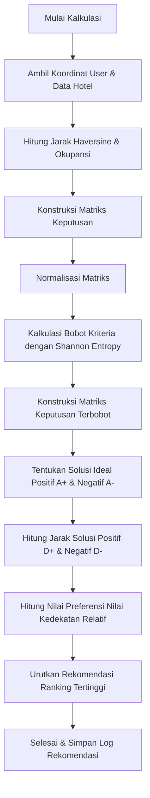

# 🏨 Hotel Recommender - Entropy-TOPSIS

[](https://www.php.net/)
[](LICENSE)
[](https://github.com/ArrafiNurHafiz/hotel-recommender-topsis)

Sistem Rekomendasi Hotel berbasis web yang mengimplementasikan metode pengambilan keputusan multi-kriteria (**MCDM**) menggunakan perpaduan algoritma **Shannon Entropy** untuk pembobotan otomatis secara dinamis dan **TOPSIS (Technique for Order of Preference by Similarity to Ideal Solution)** untuk pemeringkatan rekomendasi hotel terbaik secara personal berdasarkan posisi geografis pengguna.

---

## 💡 Ikhtisar Proyek

Sistem dibangun menggunakan arsitektur **MVC (Model-View-Controller)** murni di PHP tanpa framework berat pihak ketiga untuk memastikan efisiensi performa yang optimal. Sistem ini mempermudah pengguna menemukan hotel terbaik dengan memproses 5 kriteria secara langsung:

1. **Harga Terendah** (Cost) - Diambil dari harga kamar termurah.
2. **Rating Rata-rata** (Benefit) - Ulasan asli dari pengguna lain.
3. **Jumlah Fasilitas** (Benefit) - Keragaman fasilitas penunjang hotel.
4. **Jarak Geografis** (Cost) - Dihitung dinamis menggunakan formula *Haversine* berdasarkan koordinat GPS pengguna.
5. **Tingkat Keramaian / Okupansi** (Cost) - Persentase keterisian kamar hotel saat itu.

---

## 🧮 Cara Kerja Algoritma

Sistem ini menggunakan metode hibrida **Entropy-TOPSIS**:



### 1. Perhitungan Jarak (Haversine Formula)
Mengukur jarak lurus antara koordinat pengguna $(Lat_1, Lng_1)$ dan koordinat hotel $(Lat_2, Lng_2)$ di permukaan bumi:
$$d = 2R \cdot \arcsin\left(\sqrt{\sin^2\left(\frac{\Delta Lat}{2}\right) + \cos(Lat_1) \cdot \cos(Lat_2) \cdot \sin^2\left(\frac{\Delta Lng}{2}\right)}\right)$$
*Dimana $R = 6371$ km.*

### 2. Shannon Entropy (Pembobotan Dinamis)
Metode ini mengukur tingkat ketidakpastian informasi dalam matriks keputusan. Jika variasi data pada suatu kriteria tinggi, maka kriteria tersebut diberi bobot lebih besar secara otomatis.

### 3. Pemeringkatan TOPSIS
Memilih alternatif hotel yang memiliki jarak terdekat dari solusi ideal positif ($A^+$) dan jarak terjauh dari solusi ideal negatif ($A^-$) untuk menghasilkan nilai preferensi kedekatan relatif ($V_i$) antara `0` dan `1`.

---

## 🛠️ Fitur Utama

Sistem ini mendukung 3 peran pengguna utama:

### 👤 1. Pengguna (User / Guest)
*   **Registrasi & Autentikasi Keamanan**: Sistem login yang aman dengan enkripsi password.
*   **Rekomendasi Geografis**: Mendapatkan rekomendasi hotel terdekat dan terbaik secara instan menggunakan izin lokasi GPS.
*   **Booking Kamar**: Reservasi kamar langsung dan pelacakan status pesanan (*My Bookings*).
*   **Review & Rating**: Memberikan umpan balik rating dan ulasan teks setelah menginap.

### 🏢 2. Admin Hotel
*   **Dashboard Statistik**: Grafik/tampilan ringkas performa hotel, pesanan, dan rating.
*   **Manajemen Informasi Hotel**: Update deskripsi, fasilitas, alamat, dan titik koordinat GPS.
*   **Manajemen Kamar**: Menambah, mengubah tipe, kapasitas, harga, total kamar, dan jumlah kamar yang terisi (okupansi).
*   **Manajemen Reservasi**: Konfirmasi pesanan masuk, proses Check-in/Check-out, dan pembatalan pemesanan.
*   **Monitoring Review**: Memantau ulasan yang dikirimkan tamu hotel.

### 👑 3. Super Admin
*   **Manajemen Pengguna**: Memantau dan mengaktifkan/menonaktifkan akun user maupun admin hotel.
*   **Verifikasi Hotel**: Memvalidasi pendaftaran hotel baru sebelum dapat dicari dan masuk ke algoritma rekomendasi.
*   **Sistem Monitoring Global**: Memantau seluruh performa transaksi, hotel terverifikasi, dan log sistem secara real-time.

---

## 📂 Struktur Direktori

```bash
├── app/
│   ├── controllers/      # Logika alur aplikasi (MVC - Controller)
│   ├── models/           # Operasi database entitas objek (MVC - Model)
│   ├── services/         # Algoritma Utama (EntropyTopsis.php)
│   └── views/            # Antarmuka Tampilan HTML & CSS (MVC - View)
├── config/
│   ├── app.php           # Konfigurasi aplikasi umum (Waktu, URL, dll)
│   └── database.php      # Driver koneksi database dengan secure env load
├── core/                 # Engine inti PHP (Router, Middleware, Database PDO)
├── database/
│   ├── migration.sql     # Skema database relasional awal
│   └── reset.php         # Script utilitas reset database
├── public/               # Asset statis publik (CSS, JS, Images)
├── routes.php            # Mapping URL routing aplikasi
├── .gitignore            # File pengecualian git (DOCX, Environment, cache)
├── .htaccess             # Apache Rewrite engine rules
└── index.php             # Gerbang masuk utama aplikasi (Single Entry Point)
```

---

## ⚙️ Persyaratan Sistem & Instalasi

### Persyaratan
*   PHP `7.4` atau versi di atasnya.
*   MySQL / MariaDB Database Server.
*   Web Server Apache dengan modul `mod_rewrite` aktif.

### Instalasi

1.  **Clone Repositori**:
    ```bash
    git clone https://github.com/ArrafiNurHafiz/hotel-recommender-topsis.git
    cd hotel-recommender-topsis
    ```

2.  **Konfigurasi Database**:
    *   Buat database baru di MySQL dengan nama `hotel_recommendation`.
    *   Impor file database skema [database/migration.sql](file:///home/arrafi/program/backand/tugas%20akhir/database/migration.sql) ke database Anda.
    
3.  **Pengaturan Environment Variables (Opsional)**:
    Anda dapat mendefinisikan variable berikut di sistem operasi Anda atau web server environment:
    *   `DB_HOST` (default: `localhost`)
    *   `DB_NAME` (default: `hotel_recommendation`)
    *   `DB_USER` (default: `root`)
    *   `DB_PASS` (default: `""` / kosong)

4.  **Jalankan Aplikasi**:
    *   Jalankan php development server di direktori root proyek:
        ```bash
        php -S localhost:8080
        ```
    *   Buka browser dan akses `http://localhost:8080`.

---

## 📝 Lisensi

Proyek ini dilisensikan di bawah **MIT License**. Silakan gunakan dan kembangkan secara bebas untuk kebutuhan edukasi maupun komersial.
